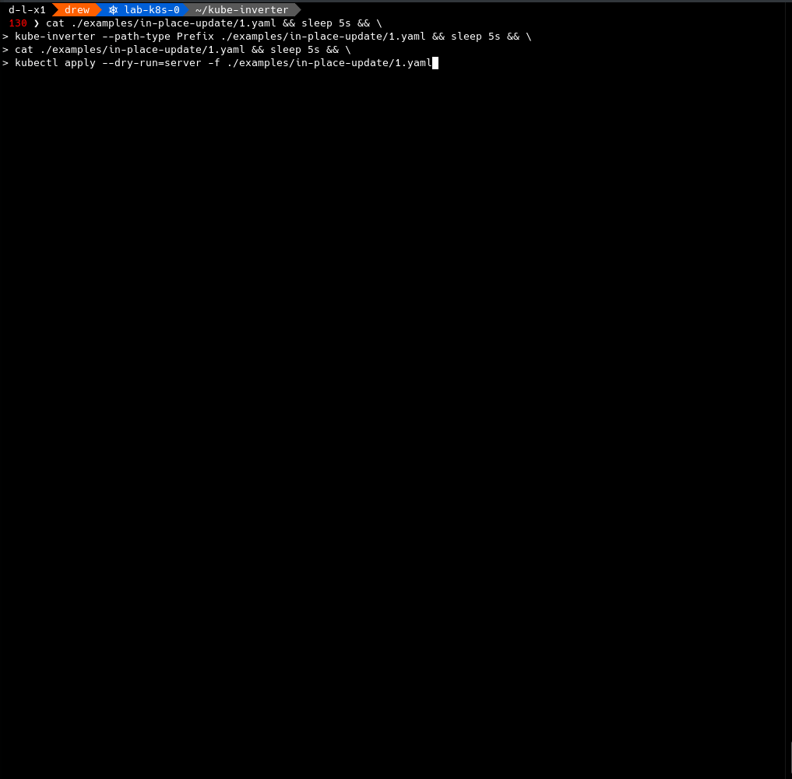

**kube-inverter**

- [What This Tool Does](#what-this-tool-does)
- [Why](#why)
- [Install](#install)
  - [Run Executable](#run-executable)
  - [PIP + `$PATH`](#pip--path)
- [CLI Usage](#cli-usage)
  - [Examples](#examples)
    - [Linux](#linux)
      - [In-place Update Against Multiple Files](#in-place-update-against-multiple-files)
      - [Write to Separate File](#write-to-separate-file)
- [Points of Interest](#points-of-interest)
  - [Details About The New API Version's `spec`](#details-about-the-new-api-versions-spec)
    - [Calculate `diff` Between Versions](#calculate-diff-between-versions)
    - [`v1beta1`](#v1beta1)
    - [`v1`](#v1)
- [Dev](#dev)
  - [Virtual Environment Setup](#virtual-environment-setup)

---

## What This Tool Does

Converts **Kubernetes** `Ingress` YAML objects with `apiVersion: networking.k8s.io/v1beta1` _to_ `apiVersion: networking.k8s.io/v1`, modifying:

- Checks for `apiVersion` differences in the [Points of Interest](#points-of-interest) section.
- The keys/values for:
  - `serviceName`
  - `ServicePort` - either name (`str`) or port number (`int`)
- (Optional) Injects a configurable `pathType` into each `Ingress` object.
- YAML Comments/order/formatting are preserved... mostly. It depends on their scope, but hey, I'm tryin'!
- Skips over objects that do not fit the criteria to be converted.

## Why

Kubernetes `v1.22` is [removing support](https://kubernetes.io/docs/reference/using-api/deprecation-guide/#ingress-v122) for the `v1beta1` **apiVersion** for **Ingress** objects, not just _deprecating_ it. And `kubectl convert` was [deprecated](https://github.com/kubernetes/kubectl/issues/725#convert-as-a-plugin) back in 1.17.

The `Ingress` syntax is changing a bit. Sure, you could update them by hand, which I do often, but that is lame. I have hundreds upon hundreds of `Ingress` objects to convert, and I bet others do as well, so this should help.


## Install

Written in Python `3.6`+

### Run Executable

**[PyInstaller](https://www.pyinstaller.org/) is used to create a single-file executable. Find them under **Assets** in [Releases](https://github.com/DaemonDude23/kube-inverter/releases).** Alternatively...

1. Get the code
```bash
git clone https://github.com/DaemonDude23/kube-inverter.git -b v0.3.0
```
2. Get into that directory
```bash
cd ./kube-inverter
```
3. Create symlink:
```bash
sudo ln -s ${PWD}/src/kube-inverter.py /usr/local/bin/kube-inverter
```

### PIP + `$PATH`

1. Get the code
```bash
git clone https://github.com/DaemonDude23/kube-inverter.git -b v0.3.0
```
2. Get into that directory
```bash
cd ./kube-inverter
```
3. Create symlink:
```bash
sudo ln -s ${PWD}/src/kube-inverter.py /usr/local/bin/kube-inverter
```
4. Install dependencies:
```bash
pip3 install -U -r ./src/requirements.txt
```

## CLI Usage

- **By default, this will update your file in place**. If that's not desired, write to a separate file with `--output-file`.
- Only one file is updated per run. Wrap this script in a loop (see examples further down) to operate against multiple files.

```
usage: kube-inverter [-h] [--debug] [--output-file OUTPUT_FILE] [--path-type PATH_TYPE] [--version] input_file

Converts Kubernetes Ingress objects from 'networking.k8s.io/v1beta1' to 'networking.k8s.io/v1'

optional arguments:
  -h, --help            show this help message and exit

  --debug               enable debug logging (default: False)
  --output-file OUTPUT_FILE, -o OUTPUT_FILE
                        Output file path. This disables an in-place update to the input file (default: None)
  --path-type PATH_TYPE, --pathType PATH_TYPE, -p PATH_TYPE
                        Path Type for Ingress rule. Options: 'Exact', 'ImplementationSpecific', 'Prefix' (default: None)
  --version, -v         show program's version number and exit
  input_file            input file
```

### Examples

_See [examples](examples/) folder._

The GIF below was generated with these commands:

```bash
cat ./examples/in-place-update/1.yaml && sleep 5s && \
kube-inverter --path-type Prefix ./examples/in-place-update/1.yaml && sleep 5s && \
cat ./examples/in-place-update/1.yaml && sleep 5s && \
kubectl apply --dry-run=server -f ./examples/in-place-update/1.yaml && sleep 5s
```



#### Linux

```bash
kube-inverter ./examples/in-place-update/1.yaml
```

##### In-place Update Against Multiple Files

```bash
find ./examples/in-place-update/ -type f -name '*.yaml' -exec kube-inverter '{}' \;
```

##### Write to Separate File

```bash
find ./examples/multiple-documents/ -type f -name '*.yaml' -exec kube-inverter --path-type Prefix '{}' -o '{}'-out \;
```

## Points of Interest

### Details About The New API Version's `spec`

#### Calculate `diff` Between Versions

```bash
diff <(kubectl explain ingresses --api-version=networking.k8s.io/v1beta1 --recursive) <(kubectl explain ingresses --api-version=networking.k8s.io/v1 --recursive)
```

<details>
<summary>Click to expand output</summary>


```diff
2c2
< VERSION:  networking.k8s.io/v1beta1
---
> VERSION:  networking.k8s.io/v1
43c43
<       backend <Object>
---
>       defaultBackend  <Object>
48,49c48,52
<          serviceName  <string>
<          servicePort  <string>
---
>          service      <Object>
>             name      <string>
>             port      <Object>
>                name   <string>
>                number <integer>
60,61c63,67
<                   serviceName <string>
<                   servicePort <string>
---
>                   service     <Object>
>                      name     <string>
>                      port     <Object>
>                         name  <string>
>                         number        <integer>
```

</details>

#### `v1beta1`

```bash
kubectl explain ingresses --api-version=networking.k8s.io/v1beta1 --recursive
```

<details>
<summary>Click to expand output</summary>

```
KIND:     Ingress
VERSION:  networking.k8s.io/v1beta1

DESCRIPTION:
     Ingress is a collection of rules that allow inbound connections to reach
     the endpoints defined by a backend. An Ingress can be configured to give
     services externally-reachable urls, load balance traffic, terminate SSL,
     offer name based virtual hosting etc.

FIELDS:
   apiVersion   <string>
   kind <string>
   metadata     <Object>
      annotations       <map[string]string>
      clusterName       <string>
      creationTimestamp <string>
      deletionGracePeriodSeconds        <integer>
      deletionTimestamp <string>
      finalizers        <[]string>
      generateName      <string>
      generation        <integer>
      labels    <map[string]string>
      managedFields     <[]Object>
         apiVersion     <string>
         fieldsType     <string>
         fieldsV1       <map[string]>
         manager        <string>
         operation      <string>
         time   <string>
      name      <string>
      namespace <string>
      ownerReferences   <[]Object>
         apiVersion     <string>
         blockOwnerDeletion     <boolean>
         controller     <boolean>
         kind   <string>
         name   <string>
         uid    <string>
      resourceVersion   <string>
      selfLink  <string>
      uid       <string>
   spec <Object>
      backend   <Object>
         resource       <Object>
            apiGroup    <string>
            kind        <string>
            name        <string>
         serviceName    <string>
         servicePort    <string>
      ingressClassName  <string>
      rules     <[]Object>
         host   <string>
         http   <Object>
            paths       <[]Object>
               backend  <Object>
                  resource      <Object>
                     apiGroup   <string>
                     kind       <string>
                     name       <string>
                  serviceName   <string>
                  servicePort   <string>
               path     <string>
               pathType <string>
      tls       <[]Object>
         hosts  <[]string>
         secretName     <string>
   status       <Object>
      loadBalancer      <Object>
         ingress        <[]Object>
            hostname    <string>
            ip  <string>
            ports       <[]Object>
               error    <string>
               port     <integer>
               protocol <string>
```

</details>

#### `v1`

```bash
kubectl explain ingresses --api-version=networking.k8s.io/v1 --recursive
```

<details>
<summary>Click to expand output</summary>

```
KIND:     Ingress
VERSION:  networking.k8s.io/v1

DESCRIPTION:
     Ingress is a collection of rules that allow inbound connections to reach
     the endpoints defined by a backend. An Ingress can be configured to give
     services externally-reachable urls, load balance traffic, terminate SSL,
     offer name based virtual hosting etc.

FIELDS:
   apiVersion   <string>
   kind <string>
   metadata     <Object>
      annotations       <map[string]string>
      clusterName       <string>
      creationTimestamp <string>
      deletionGracePeriodSeconds        <integer>
      deletionTimestamp <string>
      finalizers        <[]string>
      generateName      <string>
      generation        <integer>
      labels    <map[string]string>
      managedFields     <[]Object>
         apiVersion     <string>
         fieldsType     <string>
         fieldsV1       <map[string]>
         manager        <string>
         operation      <string>
         time   <string>
      name      <string>
      namespace <string>
      ownerReferences   <[]Object>
         apiVersion     <string>
         blockOwnerDeletion     <boolean>
         controller     <boolean>
         kind   <string>
         name   <string>
         uid    <string>
      resourceVersion   <string>
      selfLink  <string>
      uid       <string>
   spec <Object>
      defaultBackend    <Object>
         resource       <Object>
            apiGroup    <string>
            kind        <string>
            name        <string>
         service        <Object>
            name        <string>
            port        <Object>
               name     <string>
               number   <integer>
      ingressClassName  <string>
      rules     <[]Object>
         host   <string>
         http   <Object>
            paths       <[]Object>
               backend  <Object>
                  resource      <Object>
                     apiGroup   <string>
                     kind       <string>
                     name       <string>
                  service       <Object>
                     name       <string>
                     port       <Object>
                        name    <string>
                        number  <integer>
               path     <string>
               pathType <string>
      tls       <[]Object>
         hosts  <[]string>
         secretName     <string>
   status       <Object>
      loadBalancer      <Object>
         ingress        <[]Object>
            hostname    <string>
            ip  <string>
            ports       <[]Object>
               error    <string>
               port     <integer>
               protocol <string>
```

</details>

## Dev

- [Build Docs](./docs/dev.md)

### Virtual Environment Setup

```bash
# assuming virtualenv is already installed...
virtualenv --python=python3.9 ./venv/
source ./venv/bin/activate
./venv/bin/python -m pip install --upgrade pip
pip3 install -U -r ./src/requirements.txt
```
